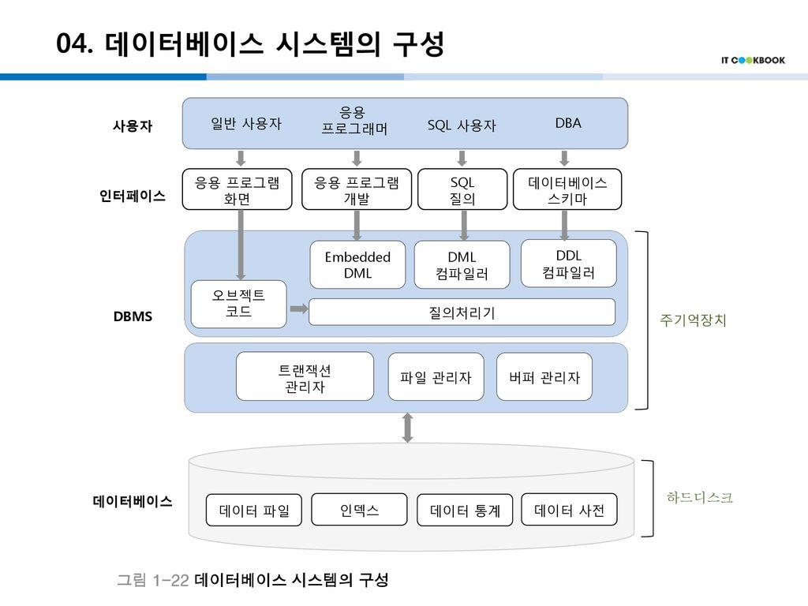

# Database

데이터베이스_시스템

---

# What is a database?

데이터 + 베이스

조직에 필요한 정보를 얻기 위해 논리적으로 연관된 데이터들을 모아 구조적으로 통합해놓은 것

데이터베이스는 운영 데이터를 통합하여 저장하며 공용으로 사용한다.

# Database system configuration

  

### DBMS

데이터를 사용할 수 있도록 도와주는 소프트웨어

파일관리자, 버퍼관리자는 데이터 베이스를 메모리 위에 올리기 위한 구성요소이다.

하드디스크에 있는 데이터들을 실제로 사용하기 위해서 파일관리자를 통해 버퍼관리자인 메모리 위헤 올라가야 한다.

